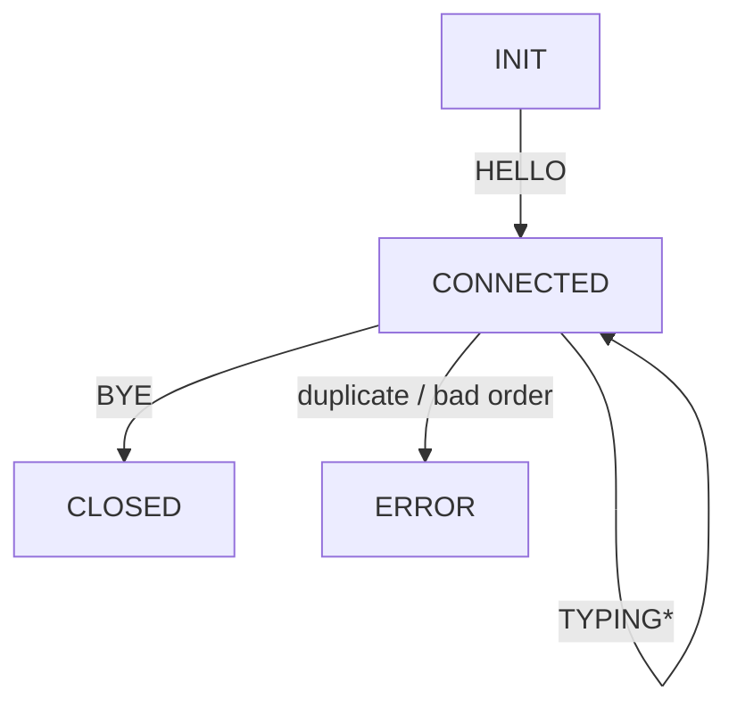

# QUICCHAT
# QUICChat – CS-544 Project

A fully-functional peer-to-peer chat system built on **QUIC** using [aioquic](https://github.com/aiortc/aioquic).  
It demonstrates handshake validation, duplicate-free messaging with ACK + auto-retransmit and GUI.

---

## Directory layout
```text
quicchat/
├── server.py            # QUICChat broadcast server
├── gui_client.py        # Tk-based client with typing indicator
├── quic_protocol.py     # Dataclass PDU definitions & codec
├── requirements.txt     # aioquic, pytest, etc.
├── certs/               # Self-signed TLS cert/key live here
└── README.md            # (this file)
```

---

## Quick start

### 1 — Create & activate virtual-env, install deps
```bash
python3 -m venv .venv
source .venv/bin/activate      # Windows: .venv\Scripts\activate
pip install -r requirements.txt
```

### 2 — Generate a self-signed dev certificate
```bash
mkdir -p certs
openssl req -x509 -newkey rsa:2048 -nodes \
  -keyout certs/key.pem \
  -out    certs/cert.pem \
  -subj   "/CN=QUICCHAT" -days 365
```

### 3 — Start the server
```bash
python server.py --cert certs/cert.pem --key certs/key.pem
```

### 4 — Launch clients on different terminals
```bash
# GUI clients
python gui_client.py --host 127.0.0.1 --port 4433 --name Alice
python gui_client.py --host 127.0.0.1 --port 4433 --name Bob

```

---

## Protocol overview

### PDU table

| Wire `type`      | Dataclass  | Fields                     | Purpose                               |
|------------------|------------|----------------------------|---------------------------------------|
| `CHAT_HELLO`     | `Hello`    | `name`                     | First packet sent by client           |
| `CHAT_WELCOME`   | `Welcome`  | `seq`, `server`            | Server handshake response             |
| `CHAT_MESSAGE`   | `ChatMsg`  | `seq`, `sender`, `text`    | User chat line                        |
| `CHAT_RECEIPT`   | `Receipt`  | `ack`                      | ACK for a specific `seq`              |
| `CHAT_TYPING`    | `Typing`   | `who`, `status`            | Typing indicator on/off               |
| `CHAT_BYE`       | `Bye`      | `reason` *(optional)*      | Graceful disconnect                   |
| `CHAT_ERROR`     | `Error`    | `code`, `msg`              | Protocol violation report             |

---

## Server state diagram


---

## Reliability features

* **Sequence numbers** – monotonically increasing per client  
* **Duplicate suppression** – server drops any `seq ≤ last_seq`, returns `CHAT_ERROR 409`  
* **Per-message ACKs** – every `CHAT_MESSAGE` triggers a `CHAT_RECEIPT`  
* **Automatic resend** – client retries un-ACKed messages every 1 s (max 3)  
* **Immediate flush** – both server and client call `transmit()` after each `send_stream_data`  
