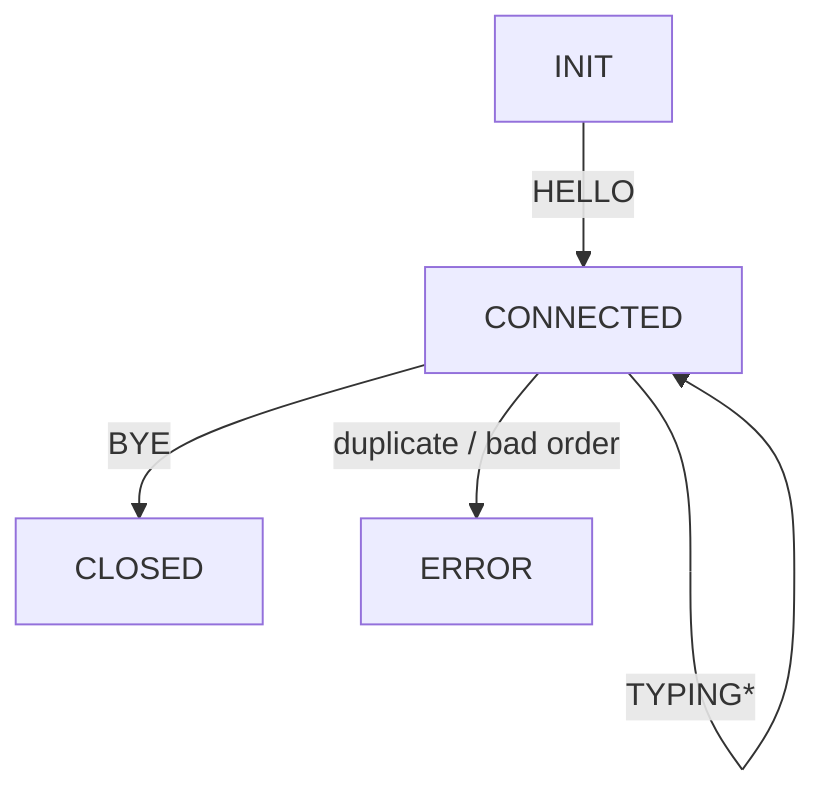

# QUICCHAT
# QUICChat – CS-544 Project

A fully-functional peer-to-peer chat system built on **QUIC** using [aioquic](https://github.com/aiortc/aioquic).  
It demonstrates handshake validation, duplicate-free messaging with ACK + auto-retransmit and GUI.

---

## Directory layout
```text
quicchat/
├── server.py            # QUICChat broadcast server
├── gui_client.py        # Tk-based client with typing indicator
├── quic_protocol.py     # Dataclass PDU definitions & codec
├── requirements.txt     # aioquic, pytest, etc.
├── certs/               # Self-signed TLS cert/key live here
└── README.md            # (this file)
```

---

## Quick start

### 1 — Create & activate virtual-env, install deps
```bash
python3 -m venv .venv
source .venv/bin/activate      # Windows: .venv\Scripts\activate
pip install -r requirements.txt
```

### 2 — Generate a self-signed dev certificate
```bash
mkdir -p certs
openssl req -x509 -newkey rsa:2048 -nodes \
  -keyout certs/key.pem \
  -out    certs/cert.pem \
  -subj   "/CN=QUICCHAT" -days 365
```

### 3 — Start the server
```bash
python server.py --cert certs/cert.pem --key certs/key.pem
```

### 4 — Launch clients on different terminals
```bash
# GUI clients
python gui_client.py --host 127.0.0.1 --port 4433 --name Alice
python gui_client.py --host 127.0.0.1 --port 4433 --name Bob

```

---

## Protocol overview

### PDU table

| Wire `type`      | Dataclass  | Fields                     | Purpose                               |
|------------------|------------|----------------------------|---------------------------------------|
| `CHAT_HELLO`     | `Hello`    | `name`                     | First packet sent by client           |
| `CHAT_WELCOME`   | `Welcome`  | `seq`, `server`            | Server handshake response             |
| `CHAT_MESSAGE`   | `ChatMsg`  | `seq`, `sender`, `text`    | User chat line                        |
| `CHAT_RECEIPT`   | `Receipt`  | `ack`                      | ACK for a specific `seq`              |
| `CHAT_TYPING`    | `Typing`   | `who`, `status`            | Typing indicator on/off               |
| `CHAT_BYE`       | `Bye`      | `reason` *(optional)*      | Graceful disconnect                   |
| `CHAT_ERROR`     | `Error`    | `code`, `msg`              | Protocol violation report             |

---

## Server state diagram


---

## Reliability features

* **Sequence numbers** – monotonically increasing per client  
* **Duplicate suppression** – server drops any `seq ≤ last_seq`, returns `CHAT_ERROR 409`  
* **Per-message ACKs** – every `CHAT_MESSAGE` triggers a `CHAT_RECEIPT`  
* **Automatic resend** – client retries un-ACKed messages every 1 s (max 3)  
* **Immediate flush** – both server and client call `transmit()` after each `send_stream_data`

## Implementation Feedback Reflection

When I actually wrote the QUICChat code instead of just sketching it on paper, I discovered that some of my “clean” design ideas introduced more friction than value. For example, I had planned a compact 9-byte binary header on every message to pack in version, flags, and IDs. In practice, writing and debugging that header packing slowed down development and made it harder to inspect traffic in Wireshark. After switching to JSON-based PDUs, I could iterate faster, read my own logs instantly, and still leave room in the spec for a binary framing layer as a “v2 optimization.”

Similarly, I’d originally envisioned one QUIC stream per chat line to avoid head-of-line blocking. Once I built the client and server, though, I saw that `aioquic` multiplexes all streams over the same UDP socket, and spawning dozens of streams actually throttled throughput. I simplified the spec to use a single bidirectional stream for chat and reserved extra streams only for large payloads (e.g., file transfers). That change cut boilerplate and matched the real behavior of the library.

On the reliability side, I assumed duplicate suppression could live in each client. During testing, however, a buggy CLI client resent the same sequence number twice and sent the server into an endless ACK loop. I moved the `last_seq` check into the server, defined a `CHAT_ERROR 409` response when it saw a replayed or out-of-order message, and updated the spec to make the server authoritative on ordering. I also learned that `send_stream_data()` merely stages frames until you call `transmit()`, so I added an explicit “always call `transmit()`” note in the spec to prevent silent failures.

Finally, my initial spec left out formal ACKs and retransmits beyond QUIC’s built-in mechanisms. In the implementation, I added a `CHAT_RECEIPT` for every message and built a client-side watchdog that retries un-ACKed lines up to three times, once per second. The revised protocol now spells out these ACK + retry rules so that anyone reading the spec knows exactly how we ensure at-most-once, in-order delivery on top of QUIC. These feedback-driven tweaks—paring down unneeded complexity and hardening weak spots—turned an academic design into a working, maintainable protocol.

